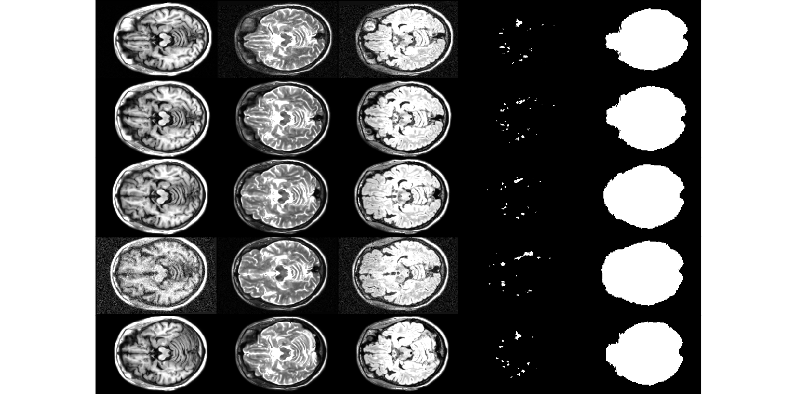

.. -*- mode: rst -*-

|PythonVersion|_ |Coveralls|_ |Travis|_ |PyPi|_ |Doc|_

.. |PythonVersion| image:: https://img.shields.io/badge/python-3.6%20%7C%203.7%20%7C%203.8-blue
.. _PythonVersion: https://img.shields.io/badge/python-3.6%20%7C%203.7%20%7C%203.8-blue

.. |Coveralls| image:: https://coveralls.io/repos/neurospin-deepinsight/brainrise/badge.svg?branch=master&service=github
.. _Coveralls: https://coveralls.io/github/neurospin/brainrise

.. |Travis| image:: https://travis-ci.com/neurospin-deepinsight/brainrise.svg?branch=master
.. _Travis: https://travis-ci.com/neurospin/brainrise

.. |PyPi| image:: https://badge.fury.io/py/brainrise.svg
.. _PyPi: https://badge.fury.io/py/brainrise

.. |Doc| image:: https://readthedocs.org/projects/brainrise/badge/?version=latest
.. _Doc: https://brainrise.readthedocs.io/en/latest/?badge=latest

brainrise: Brain MRI Data Augmentation for PyTorch
==================================================

\:+1: If you are using the code please add a star to the repository :+1:

PyTorch toolbox with common brain MRI data augmentation methods.

This work is made available by a `community of people
<https://github.com/neurospin-deepinsight/brainrise/blob/master/AUTHORS.rst>`_, amoung which the
CEA Neurospin BAOBAB laboratory.

    
Important links
===============

- `Official source code repo <https://github.com/neurospin-deepinsight/brainrise>`_
- HTML stable documentation: WIP
- `HTML documentation <https://brainrise.readthedocs.io/en/latest>`_
- `Release notes <https://github.com/neurospin-deepinsight/brainrise/blob/master/CHANGELOG.rst>`_

Where to start
==============

Examples are available in the
`gallery <https://brainrise.readthedocs.io/en/latest/auto_gallery/gallery.html>`_.
All datasets are described in the
`API documentation <https://brainrise.readthedocs.io/en/latest/generated/brainrise.html>`_.

Install
=======

The code has been developed for PyTorch version 1.8.1 and torchvision
version 0.9.1, but should work with newer versions as well.
Make sure you have installed all the package dependencies.
Complete instructions are available `here
<https://brainrise.readthedocs.io/en/latest/generated/installation.html>`_.

License
=======

This project is under the followwing
`LICENSE <https://github.com/neurospin-deepinsight/brainrise/blob/master/LICENSE.rst>`_.

